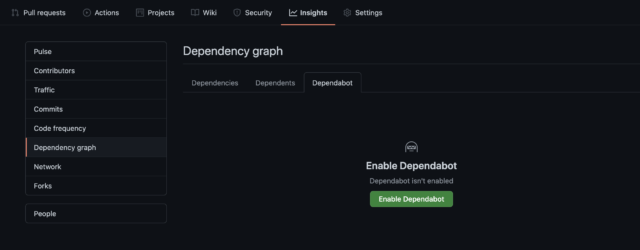
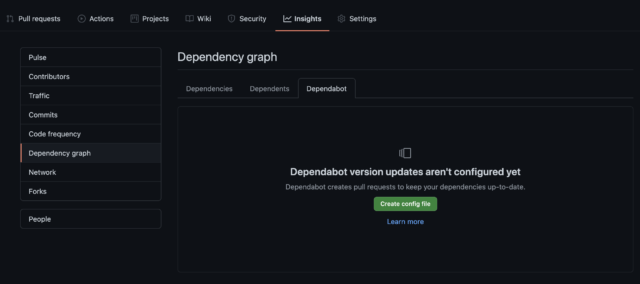
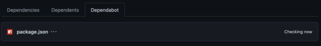

### 1.Insights>Dependencygraph>Dependabotを開く
Insights>Dependency　graph>Dependabotを選択して「Enable Dependabot」を押下します。



### 2.画面の表示の変化を確認
「Enable Dependabot」を押下すると以下のような表示に変わります。



### 3.「.github/dependabot.yml」ファイルを作成
今回はTypeScriptのモノレポプロジェクトなので、 package-ecosystem: 'npm' としました。

```yaml
version: 2
updates:
  - package-ecosystem: 'npm' # See documentation for possible values
    directory: '/' # Location of package manifests
    schedule:
      interval: 'daily'
```

### 4.しばらく待つ
1〜2時間程度待つと表示が代わり、DependabotによるライブラリアップデートPRの作成が始まります。


