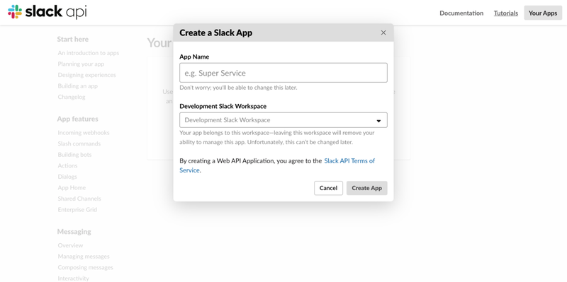
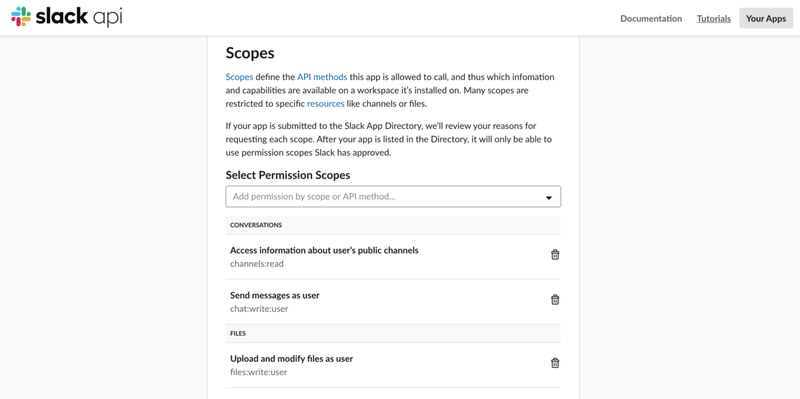
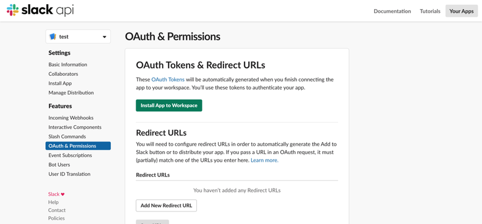
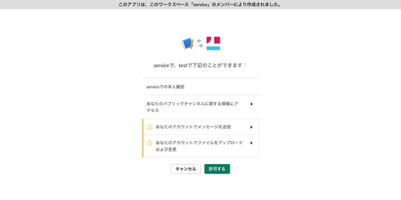
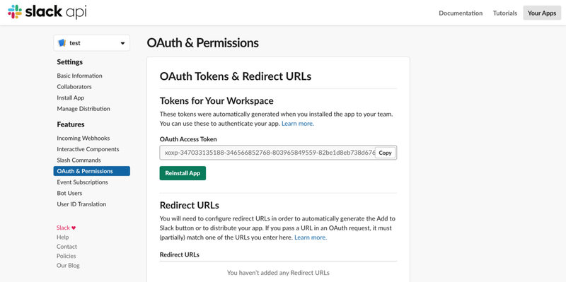
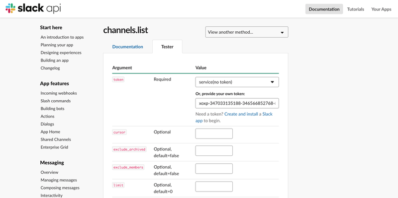

1. Slackへ行ってアプリ作成


2. OAuth & Permissions＞Scopesにてパーミッション追加（channels:read、chat:write:user、files:write:userの３つ）


3. アプリをワークスペースにインストール




4. 発行されたトークンを利用してchannels.list＞Testerでchannelのidを調べる


5. プログラム（メッセージ投稿）

```py
import requests

url = "https://slack.com/api/chat.postMessage"
data = {
   "token": "<your oauth access token>",
   "channel": "<your channel id>",
   "text": "Hello world"
}
requests.post(url, data=data)
```
